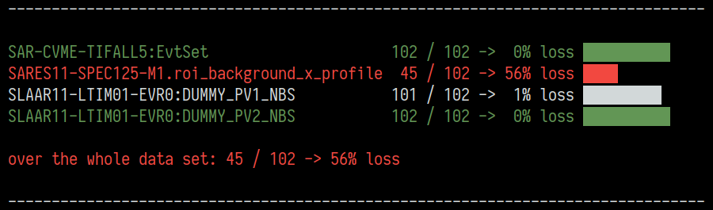

# SwissFEL Data Files

This module provides an easy way of dealing with SwissFEL data files.

## Usage example

The following example serves as illustration of the general work flow:

```python
from matplotlib import pyplot as plt
from sfdata import SFDataFiles

with SFDataFiles("/sf/instrument/data/p12345/raw/something/run_000041.*.h5") as data:
    subset = data["SIGNAL_CHANNEL", "BACKGROUND_CHANNEL"]
    subset.drop_missing()
    pids = subset["SIGNAL_CHANNEL"].pids
    sig = subset["SIGNAL_CHANNEL"].data
    bkg = subset["BACKGROUND_CHANNEL"].data

norm = sig - bkg

plt.plot(pids, norm)
plt.show()
```

## Open (and close) files

The main entry point is the `SFDataFiles` class:

```python
from sfdata import SFDataFiles
```

which itself is an `SFData` subclass that handles HDF5 files.

Files can be opened as contexts:

```python
with SFDataFiles("run_000041.BSREAD.h5") as data:
    do_something_with(data)
```

in which case, they don't need to be closed manually. Or assigned to a variable

```python
data = SFDataFiles("run_000041.BSREAD.h5")
do_something_with(data)
data.close()
```

where they should be closed at the end.

Besides a single filename as shown above, `SFDataFiles` also accepts several filenames and/or filenames with wildcards (`*`, `?`) in which case the channels of all given files will be merged into a single `SFData` object:

```python
SFDataFiles("run_000041.*.h5")
SFDataFiles("run_000041.BSREAD.h5", "run_000041.CAMERA.h5")
```

Note that if channels occur in several files, only the last instance will be available in the `SFData` object. Channels will not be appended along the pulse ID axis. Thus, currently, it only makes sense to open files from one run at the same time.

`SFDataFiles` is a convenience wrapper which internally creates one `SFDataFile` (note the missing s) object for each given filename. `SFDataFile` works identical to `SFDataFiles` but accepts only a single filename as argument.

## Channels

A list of available channels can be viewed via

```python
data.names
```

The channels within the HDF5 files are represented by the `SFChannel` class and can be retrieved from the `SFData` object like from a dictionary:

```python
ch = data["SLAAR11-LTIM01-EVR0:DUMMY_PV1_NBS"]
```

Note that, here, the channel name can be tab completed in ipython or jupyter.

### Regular access

The pulse IDs and data contents can be accessed via

```python
ch.pids
ch.data
```

which reads the full arrays at once from the HDF5 file (it should be noted that this is currently not cached!). In most cases, this will be the preferred way of reading data.

### Access in batches

If the full data array is too large to be held in memory at once (which is mainly a concern for camera images), it can be read in batches of valid entries instead:

```python
for indices, batch in ch.in_batches():
    for image in batch:
        do_something_with(image)
```

For adjusting the memory consumption, the batching method accepts the batch size as argument:

```python
SFChannel.in_batches(size=100)
```

Batching yields `indices`, the current index slice within the whole valid data, and `batch`, a numpy array containing the current batch of valid data.

In most cases a reducing operation is supposed to be applied to the data and the result is to be stored in an array with the first axis corresponding to the valid pulse IDs. For this, `indices` can be put to use. A simple example would be to sum over each image individually in order to get an intensity information per pulse:

```python
inten = np.empty(ch.nvalid)
for indices, batch in ch.in_batches():
    inten[indices] = batch.sum(axis=(1, 2))
```

To simplify this workflow, the convenience method `apply_in_batches` is available:

```python
def proc(batch):
    return batch.sum(axis=(1, 2))

inten = ch.apply_in_batches(proc)
```

It should be noted that the processor function does **not** need to return a 1D array. If there are `nvalid` entries in the channel and a single processed entry is of the shape `single_shape`, the result will be of the shape `(nvalid, *single_shape)`.

### Access via datasets

In case the underlying HDF5 datasets need to be accessed, e.g., for reading only specific parts of the data, channels have a `datasets` namespace attached: 

```python
ch.datasets.pids
ch.datasets.data
```

In order to actually read the data from the file in this case, standard HDF5 syntax applies:

```python
ch.datasets.pids[:]
ch.datasets.data[100:200]
```

## Subsets

Subsets of the data can be accessed by giving several channel names

```python
subset = data["SLAAR11-LTIM01-EVR0:DUMMY_PV1_NBS", "SLAAR11-LTIM01-EVR0:DUMMY_PV2_NBS"]
```

which returns an `SFData` object that contains only the specified channels. `SFData` works identical to `SFDataFile(s)`. Specifically, further subsets can be created from a subset. All subsets are real subsets of the original data. This means in particular that the data has to be read also for subsets within the file context (created by the `with` statement) or before closing the files.

## Statistics

For an overview of which channel has how many missing shots, `SFData` has a `print_stats` method:

```python
from sfdata import SFDataFile

channels = (
    "SAR-CVME-TIFALL5:EvtSet",
    "SARES11-SPEC125-M1.roi_background_x_profile",
    "SLAAR11-LTIM01-EVR0:DUMMY_PV1_NBS",
    "SLAAR11-LTIM01-EVR0:DUMMY_PV2_NBS"
)

with SFDataFile("run_000041.BSREAD.h5") as data:
    subset = data[channels]
    subset.print_stats(show_complete=True)
```

This results in output like this:



The statistics overview can also be directly accessed via the included command line tool `sfdstats`.

## Drop missing pulses

For correlating channels, pulse IDs that are not available in all channels need to be removed. This can be achieved via

```python
subset.drop_missing()
```

resulting in data where data points that belong to the same pulse are matched. Internally, this is handled by updating each channels `.valid` attribute, which can be a boolean index or a list of coordinates (/indices) within the datasets (note: due to a [limitation of h5py](https://github.com/h5py/h5py/issues/626), this is only true for 1D datasets, for 2D or more only the latter works!).

The valid marker is per channel, and subsets are real subsets of the original data. Thus, valid markers set on a subset are also set for the larger parent data.

In case all `.drop_missing()` operations need to be reverted, both `SFChannel` and `SFData` have a `.reset_valid()` method (where the latter loops over the former). These reset the valid marker(s) to all pulse IDs that are in the respective underlying dataset. Note that each `.drop_missing()` calls `.reset_valid()` before calculating the new `valid` marker.

## Convert to other data formats

For more complex treatment of missing pulse IDs, e.g., imputation, `SFData` can be converted to [pandas](https://pandas.pydata.org/) [DataFrames](https://pandas.pydata.org/docs/reference/frame.html) or [xarray](https://xarray.pydata.org/) [Dataset](https://xarray.pydata.org/en/stable/generated/xarray.Dataset.html).

### Convert to pandas DataFrame

```python
df = subset.to_dataframe()
```

This way, missing entries will be marked as NaNs, and can be dealt with via, e.g., [`dropna()`](https://pandas.pydata.org/docs/reference/api/pandas.DataFrame.dropna.html) or [`fillna()`](https://pandas.pydata.org/docs/reference/api/pandas.DataFrame.fillna.html).

Note: NaN is [only defined for floats](https://en.wikipedia.org/wiki/NaN). In order to use NaNs as missing marker for all data types (specifically, also for integers or booleans), the created dataframe has the dtype `object`. After dealing with the NaNs, the dtype can be corrected using the [infer_objects](https://pandas.pydata.org/pandas-docs/stable/reference/api/pandas.DataFrame.infer_objects.html) method. Furthermore, dataframe columns can only hold 1D data natively. Thus, arrays of larger dimensionality are converted to regular lists before insertion. Depending on the use case, these lists might need to be converted to numpy arrays when taken out of the dataframe.

### Convert to xarray Dataset

```python
ds = subset.to_xarray()
```

This way, missing entries will be marked as NaNs, and can be dealt with via, e.g., [`dropna()`](https://xarray.pydata.org/en/stable/generated/xarray.Dataset.dropna.html) or [`fillna()`](https://xarray.pydata.org/en/stable/generated/xarray.Dataset.fillna.html). For `dropna()` the `dim` parameter is most likely the `"pids"` axis:

```python
ds.dropna("pids", ...)
```

